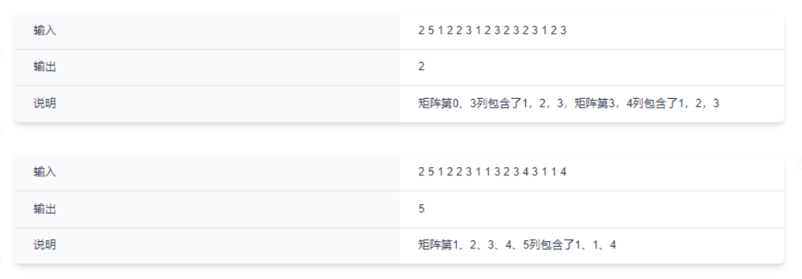

# 基本做不出来,200分
***

  ## 最长子字符串的长度(二)

  ### 题目描述
  - 给你一个字符串s,字符串s首尾相连成一个环形,请你在环中找出"l"、"o"、"x"字符都恰好出现了偶数次最长子字符串的长度
   
  ### 输入描述
  - 输入是一串小写的字母组成的字符串

  ### 输出描述
  - 输出是一个整数

  ### 代码
  

***

  ## 最小矩阵宽度

  ### 题目描述
  - 给定一个矩阵,包含N*M个整数,和一个包含K个整数的数组;现在要求在这个矩阵中找一个宽度最小的子矩阵,要求子矩阵包含数组中所有的整数

  ### 输入描述
  - 第一行输入两个正整数N,M,表示矩阵的大小
  - 接下来N行M列表示矩阵内容
  - 下一行包含一个正整数K
  - 下一行包含K个整数,表示所需包含的数组,K个整数可能存在重复数字
  - 所有输入数据小于1000

  ### 输出描述
  - 输出包含一个整数,表示满足要求子矩阵的最小宽度,若找不到,输出-1

  ### 用例
  
