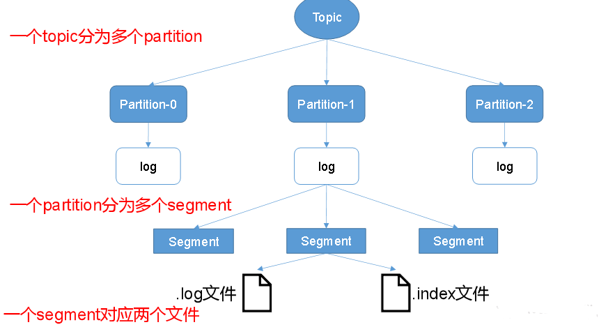
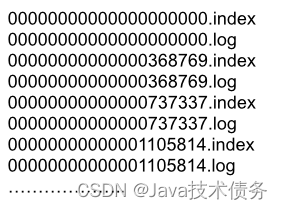
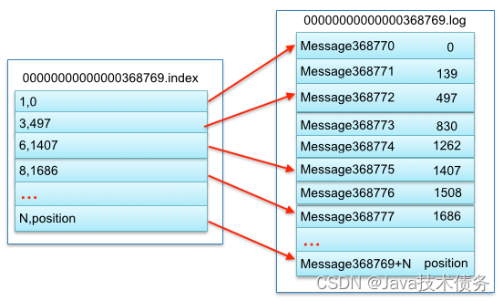

# 请简述kafka的文件存储机制或kafka的存储方案
  首先是kafka整体的文件系统的划分
  kafka采用顺序追加日志的方式来应对海量数据写操作的需求
  由于生产者生产的消息会不断追加到log文件末尾,为防止log文件过大导致数据定位效率低下,Kafka采取了分片和索引机制,将每个partition分为多个segment,每个segment
对应两个文件————.index文件和.log文件
  这里需要重点介绍一下segment中的文件存储结构:
  - segment file组成:index file 和 log file,此两个文件一一对应,成对出现
  - segment文件命名规则: partition全局第一个segment从0开始,后续每个segment文件名为上一个segment文件最后一条消息的offset值

  举例来描述kafka根据offset查找某条数据的流程:
    1)通过目标topic获取其下所有的partition信息,包括每个partition包含的segment及其范围
    2)通过offset与每个partition存储数据的偏移范围进行匹配,确定存储该offset的数据存储在具体某个partition中的某个segment;
    3)定位到了segment后,我们先来看一下segment下log和index文件的存储示例,基于此我们不难发现,log和index一一对应,而且
  二者的命名也有偏移量相关,如果我们的待查找offset是400000,我们就可以迅速确定待查找的数据是在368769的index文件下,接下来我们就进入.index文件中根据索引查找到具体的元数据,
  index文件中的元数据指向对应这log文件中数据的物理偏移位置,也就找到了数据,上述就是我们通过offset如何在kafka中快速定位某条
  数据的整体流程;
  
  除了上述的文件存储机制外,kafka还支持Gzip、Snapp和LZ4三种压缩算法,可以将消息在写入日志文件之前进行压缩,从而减少磁盘空间的占用,同时,kafka也支持基于时间或日志大小的
消息清理策略,可以根据设定的阈值自动删除过期或过大的消息,以释放存储空间;