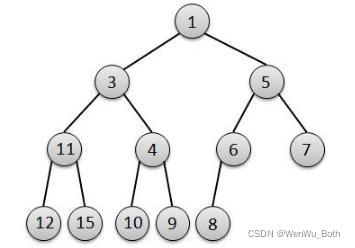

# PriorityQueue源码分析
  - 初始化
  PriorityQueue主要的构造方法有以下几种
    - 空参构造
    - 指定大小
    - 指定比较器
    - 既指定大小,又指定比较器
  不同于hashmap的懒加载,PriorityQueue会在构造方法处就直接将Object数组创建出来;
  默认Object数组的大小是11;

  - add(),其实实际的逻辑是放在offer方法中,add相当于是给我们提供一个更加醒目的api,所以用add包了一层;
    offer中分为两种情况,分别是队列空和不为空两种情况;
    - 若为空,则直接将元素插入queue[0]处即可;
    - 不为空,调用siftUp()方法,在该方法中又有两种情况
      这两种情况只在优先级的比较有所区别,在之后的数据插入和树的维护的操作都是完全一样的;
      - 将我们的待插入元素转换为一个Comparable接口类型的对象,这是为了方便我们之后的优先级比较;
      - 比较器不为空时,无需上面转换Comparable接口对象的动作
      接下来将进入一个循环,来进行真正的数据插入;插入的过程大概是:
      首先获取queue中存的真实元素的数量size,然后用key接收size+1,此时的key就表示如果作为一个普通队列,我们的数据要插入的位置;接下来就是根据默认比较器或者我们自定义的比较器进行优先级比较了,
    通过不断与父节点(通过对key-1右移一位实现获取父节点)进行优先级比较实现位置的变更,直到待插入数据的优先级小于父节点的优先级或达到头结点,最终确定位置,再将数据插入最终位置;

  - 其实PriorityQueue本质是一个最小二叉堆  
    最小二叉堆满足两个约束: 完全二叉树、所有非叶子结点的根节点value均小于其左、右子节点的value;
    第二个约束就看我们的需求了,如果我们希望数值越大优先级越高,那么实际上第二个约束就会变成所有非叶子结点的根节点value均大于其左、右子节点的value,这样就变成了最大二叉堆;

  - grow() 扩容方法;
    优先队列的扩容是比较当前优先队列的中的元素个数和当前队列长度,若元素个数已经大于等于了队列长度,那么开始扩容
    扩容时,会检查队列长度,
    - 若队列长度小于64,则会对当前队列长度进行加2,以节省内存;
    - 若队列长度大于等于64,或通过oldCapacity+oldCapacity>>1的方式进行1.5倍扩容
    扩容后会进行一个数据的拷贝,这里引入了对数组最大长度的异常判断,只有在正常的时候才会继续进行数据的拷贝,所以这点不用担心;
    虽然PriorityQueue提供了addAll()方法,但是本质上还是要一个个的调用offer方法,所以也不存在像arrayList的那种扩容时的差异;

  - remove() 移除
    首先遍历整个数组,查找key为我们要删除的那个key对应的索引下标,若是-1,说明没有该元素,则直接返回;若存在,则要进行对索引位置数据的删除;
    移除和出队二者之间区别并不大,唯一的区别是出队可以确认当前的索引是size-1,而移除则需要自己去遍历出对应的key的索引;

    每次上来的第一步都是把最后一个元素给剔除,然后把最后一个元素和我们要删除的元素的索引传进方法siftDown()中,在该方法中实际上我们是对我们要删除的节点进行一个判断;
    首先要选出带待删除元素的左子结点和右子节点中优先级更高的那个,将其与我们的最后一个元素进行比较,若优先级要比最后一个元素高,就将这个子节点移动到我们要删除的那个元素的位置上,
  这样实际上就实现了对该元素的删除,之后会继续沿着该子节点的子节点进行查找,看他的子节点中左子结点和右子节点中优先级更高的一个,将其与最后一个元素的优先级进行比较,若子节点优先级更高,
  就将该子节点放到他的父节点也就是我们更早一次移动的那个子节点的位置上,以此类推,直到发现我们最开始拿的那个queue[size-1]的那个元素的优先级已经是要比当前位置的左子结点和右子节点都要高时,
  这时将该节点插入位置,就可以实现了remove()的全过程,可以发现整个过程中其实每一次都是在对两路中的一路进行操作,另一半的结构都不会发生变化,所以

  本质上移除和出队的思路是一样的,只不过出队是把最后一个元素放在queue[0]的位置开始进行判断;而移除是把最后一个元素放在queue[i]的位置开始进行判断;