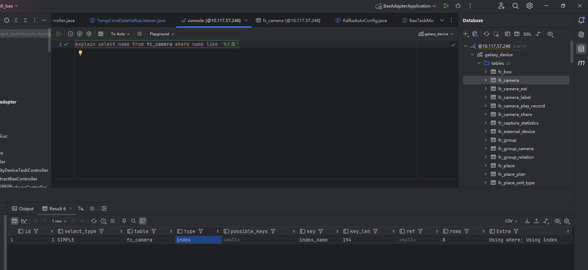

# 索引覆盖的概念和优点
  ## 索引覆盖的概念
  - 查询语句的结果可以直接由索引提供,而不需要进行回表查询
 
  ## 索引覆盖的优点
  - 避免了额外的回表查询,加快了查询速度
  - 可以把随机IO变成顺序IO,二级索引是连续的,但是回表查询时,多个页就未必连续的,这就变成了随机IO;避免发生回表也就避免了这种随机IO,而二级索引本身连续,
  并且查询所需数据均在二级索引的B+树上,则直接返回即可,是顺序IO;

  ## 索引覆盖的意义
  - 索引覆盖可以用来证明索引失效的场景并非是索引无法生效,而是优化器认为应用索引的性能并不好,而没有使用索引;
  explain select name from fc_camera where name like '%火苗' , 该段sql符合sql失效的要求,但最终应用了索引
    id | select_type | table        | type  | possible_keys |     key    |  key_len | ref  | rows | Extra
    1  | SIMPLE      | fc_camera    | index |     NULL      | index_name |   194    | NULL |  8   | Using where;Using index
