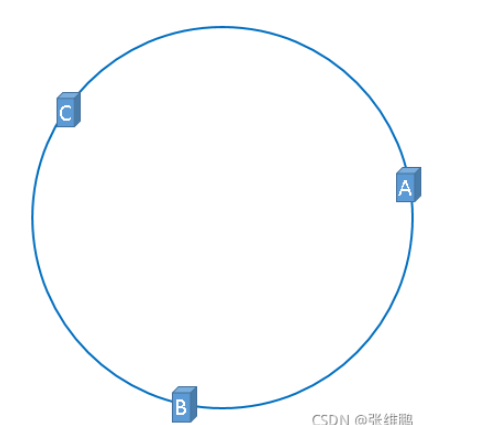

# 分布式存储算法
  - Hash取余算法
    比较简单直接,将数据进行hash后对N取余,N为集群中服务器的数量,然后把取余的结果与每台机器的数据映射范围比较,决定数据存放在哪一台具体的机器上;
    优点是可以实现亿级数据的负载均衡;缺点也比较明显,就是无论是出现宕机或是集群扩容,都需要重新计算数据映射公式,因为N变了,所以在实际开发场景中,这个落地方式不够好

  - 一致性hash算法
    一致性hash不再对服务器数量进行取模,而是对2的32次方取模,这样就可以保证一个稳定的数据映射公式,这就可以保证我们得到的哈希值是处在0~2的32次方-1这个区间内;
    我们根据服务器的ip或是server-name,总之是一个唯一标识来计算该台服务器的hash,取模后得到一个区间内的数字,进行标记
    然后再制定一个寻址规则,当一个数据想存入redis时,我们首先对其hash,取模,得到结果后开始递增寻找服务器标记点,找到的第一个服务器标记点,就是该条数据要存入的服务器,
  那如果走到尽头(2的32次方)时依然没有找到怎么办？————从0开始继续递增查找
    我们这里理解一致性hash时,把它理解为一个圆会容易很多
    从这张图来看,abc即代表了三台服务器经过计算后的标志点,在AB这个区间内的数据都会存入服务器B,而BC区间内的数据会存入服务器C,CA区间的数据会存入服务器A;可以发现相比于
  hash取余算法,一致性hash不但N不变,而且如果此时我们扩容,在AB标志点之间加入一个H,会发现,其实只有A~H这个区间内的数据需要迁移到H服务器,H~B的数据都不需要动,仍然属于B,
  不难发现,数据迁移量也减少了;
    但一致性hash也有缺点,很显著的一个问题就是数据倾斜的问题,因为我们的服务节点并不是像hash取余那样公平分配,所以是有可能出现在节点数较少的情况下,或是个别节点宕机的情况下,
  大量数据集中打在一台服务器上的情况;为了解决数据倾斜问题,我们引入了虚拟节点概念,假设我们现在有三个节点,正常会在圆上记录三个标志位,但这样容易出现数据倾斜,那我们就多进行几次
  hash,每次hash的结果都记作一个标志位,而每个标志位都指向着真实节点,这样就可以很大程度的避免数据倾斜问题;但即使引入了虚拟节点依然存在着数据存储分布不均匀的问题;

  - hash槽存储
    这也是目前大多数厂商使用的分布式存储方式,他提出了slot槽的概念,槽下是节点,而数据经过hash取模后会映射到槽上,再根据该槽对应的节点决定存入哪台具体的机器上;并且因为我们固定了
  槽位的范围0~16383,我们的槽位的取值范围会根据节点的数量进行平均分配,这样就解决了数据倾斜的问题;
    假设我们有6个节点,每个节点就会对应一段连续的槽位区间
    节点1：0~2730    节点2：2731~5460    节点3:5461~8191    节点4：8192~10922    节点5:10923~13653    节点6：13654~16383
    这样就解决了数据倾斜的问题;
    并且hash槽模式下如果新增服务器节点,会从现有的所有槽位中取出等同的一部分给新节点形成一个新的插槽,该插槽的最终容量与其他插槽相同;删除插槽也是同样,会将自己所拥有的插槽区间等分给
  其他插槽;这里需要注意,在redis主从集群部署的模式下,只根据master节点进行槽位分配,slave节点没有槽位;