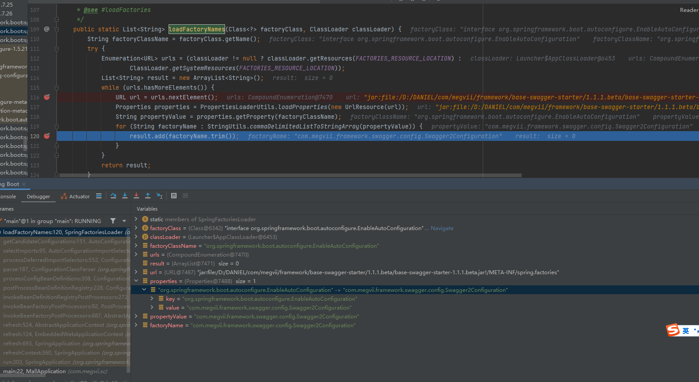
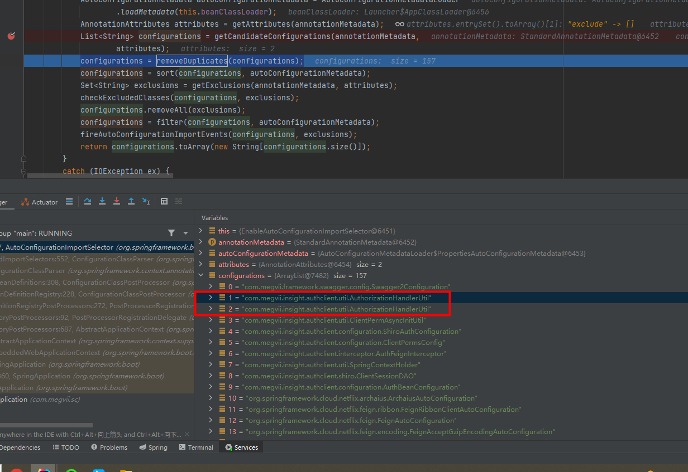

# first小吴:

# 结论:

# 改正后(可背):
  首先什么是SpringBoot的自动配置,它指的是基于你引入的依赖jar包,进行自动配置,为springboot框架的"开箱即用"提供了基础支撑;
比如我们现在想引入redis,只需要三步,首先引入redis相关依赖,然后去配置redis的服务器连接信息,最后在代码中直接将redisTemplate
注入即可使用,整个过程中我们并没有进行任何bean相关的配置,但springboot就自动完成了redis的配置,将相关的bean对象注册到IOC容器
中了; 
  接下来是Springboot实现自动配置的流程
  
  springboot启动类由@SpringBootApplication注解修饰,该注解同时包含三个子注解@SpringbootConfiguration表示该类也是spring
中的一个配置类、@ComponentScan注解,默认会扫描当前配置类所在包及其子包中的组件(这也是我们目前service,controller等包与启动类保持
同一级的原因),然后真正实现自动配置的是依赖于@EnableAutoConfiguration注解,该注解又包含两个注解@AutoConfigurationPackage和
@Import(EnableAutoConfigurationImportSelector.class),@AutoConfigurationPackage注解会将启动类所在包及其子包里面的所有
组件扫描并加载到spring容器中;
  接下来介绍@Import(EnableAutoConfigurationImportSelector.class)注解都做了什么,它也是实现自动配置的最核心的内容;
  在该类中有一个最核心的方法selectImports
  - 入参 [ AnnotationMetadata annotationMetadata ]
  在程序启动时,该方法的入参是一个AnnotationMetadata对象(该对象是一个用于解析注解信息的对象),该对象有三个属性,annotations即我们在启动类
上进行修饰的注解对象,introspectedClass即我们的启动类的类元信息,nestedAnnotationsAsMap为true,表示在解析注解时倾向于深度解析注解的嵌套
结构,具体来说,nestedAnnotationsAsMap为true时,会考虑嵌套在当前注解中的所有其他注解,并将其解析为一个嵌套结构的Map,以便进一步处理;

  - 第一块代码 [ AutoConfigurationMetadata autoConfigurationMetadata = AutoConfigurationMetadataLoader.loadMetadata(this.beanClassLoader) ]
  该方法将会加载spring-boot-autoconfigure包下META-INF/spring-autoconfigure-metadata.properties中所有以org.springframework.boot.autoconfigure开头的
配置信息,然后以键值对的形式存入autoConfigurationMetadata对象中

  - 第二块代码 [ AnnotationAttributes attributes = getAttributes(annotationMetadata) ]
  该方法最终放回了一个attributes对象,该对象本质是一个LinkedHashMap对象,该对象有两个key,分别是"excludeName"和"exclude",value均为一个空的String数组;
  目的在于获取一些由我们代码中手动标明的不需要自动装配的信息;

  - 第三块代码 [ List<String> configurations = getCandidateConfigurations(annotationMetadata, attributes) ]
  传入的参数分别是最开始的入参annotationMetadata和刚才拿到的LinkedHashMap对象attributes,这里需要深入一点的说一下,看图
在这里我们会开始根据我们项目所需来遍历我们maven仓库中(也许说成项目所依赖)的jar包中的factories,然后也是会组成一个map,之后我们要判断这个map的key是否是org.springframework.boot.autoconfigure.EnableAutoConfiguration,
如果是,那么对应的value就会存入一个List<String>当中,我们最后拿到的configurations就是它;、

  - 第四块代码 [ configurations = removeDuplicates(configurations) ]
  去除数组中重复的值;

  - 第五块代码 [ configurations = sort(configurations, autoConfigurationMetadata) ]
  Springboot应用程序启动时,会加载多个配置类,这些配置类可能存在依赖关系或者需要按照特定的顺序加载,通过调用sort方法,可以根据我们第一块代码拿到的autoConfigurationMetadata来
确保各个配置类以正确的顺序加载,可以避免因类加载顺序不正确而导致的问题;

  - 第六块代码 [ Set<String> exclusions = getExclusions(annotationMetadata, attributes); checkExcludedClasses(configurations, exclusions); configurations.removeAll(exclusions) ]
  这三块代码的核心是从我们的配置list中去除那些不需要被加载的配置类,目前我开发的项目中的源码我看一般都是0;

  - 第七段代码 [ configurations = filter(configurations, autoConfigurationMetadata) ]
  当一个配置类上添加了条件注解@Conditional,只有当条件满足,该配置类才会被装配
  即在这里会进行一次过滤,根据@Conditional过滤掉不必要的自动配置类,也就是不满足条件的配置类不会被自动装配;

  - 第八段代码 [ fireAutoConfigurationImportEvents(configurations, exclusions) ]
  这部分是创建了一个配置类监听器对自动配置进行监听,跟自动装配核心思路关系不大,就不展开了

  - 基于上面这些步骤,最终完成了自动装配