# 五星考点
  - 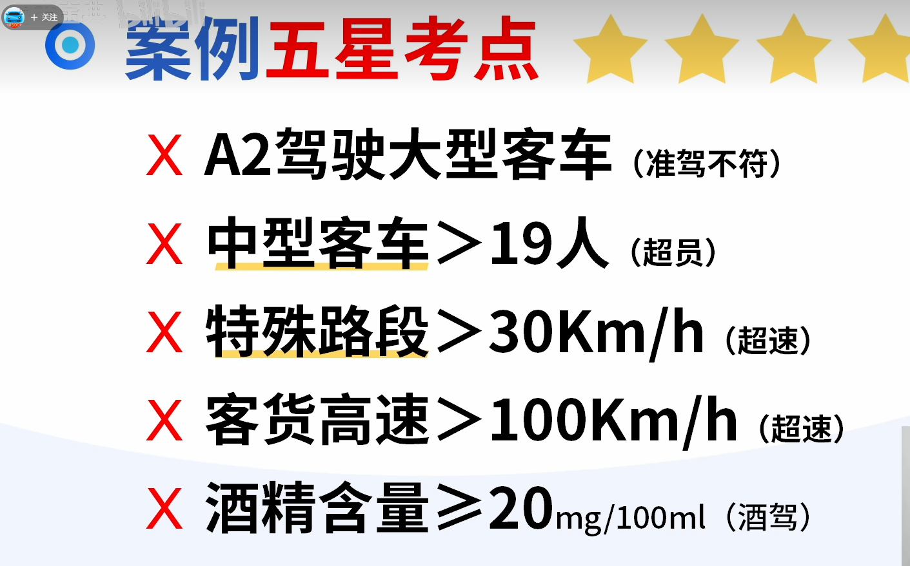
 
  - 中型客车只能装10-19人
  - 特殊路段(弯道、交叉路口),速度不能超过30km/h
  - 客货告诉最高开100km/h
  - 酒精含量 >= 20mg/100ml 都属于酒驾
  - 疲劳驾驶420,即开车4个小时就要休息20分钟

# 交通信号
  ## 交警手势
  - 左高右低要喊停,左手高,右手低,需要停车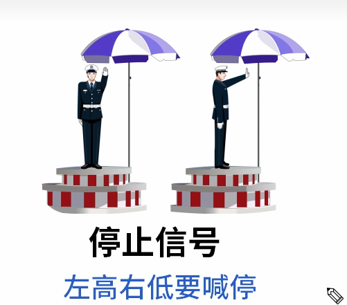
  - 双手从未放下是直行的信号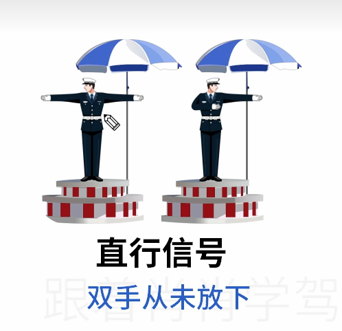
  - 单右手向中间摆动是变道信号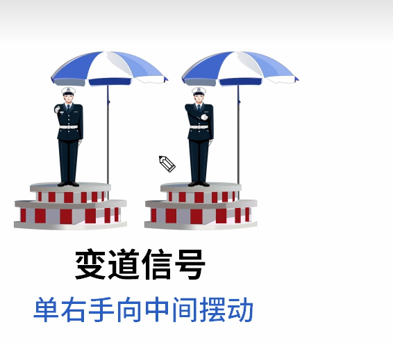
  - 单右手下压是减速慢行信号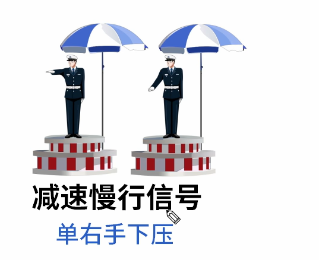
  - 单左手下压是左转弯待转信号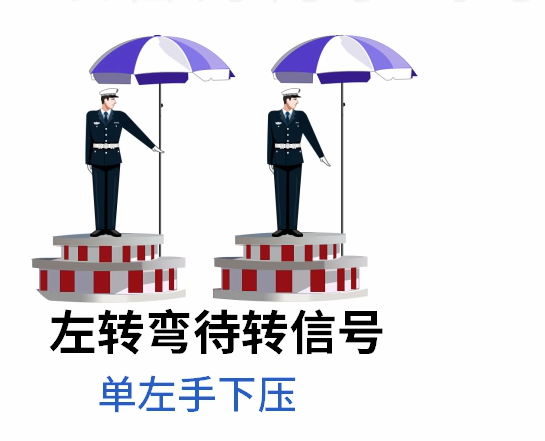
  - 
  - 易错考点:
    - 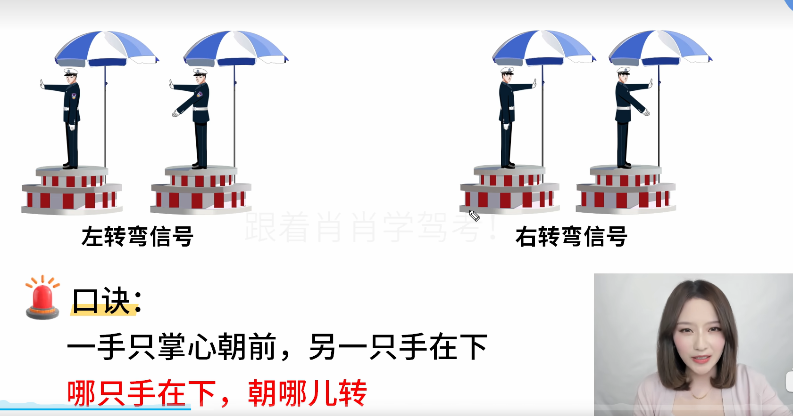
    - 一只手掌心在前,另一只手在下,则哪只手在下,朝哪转

    - 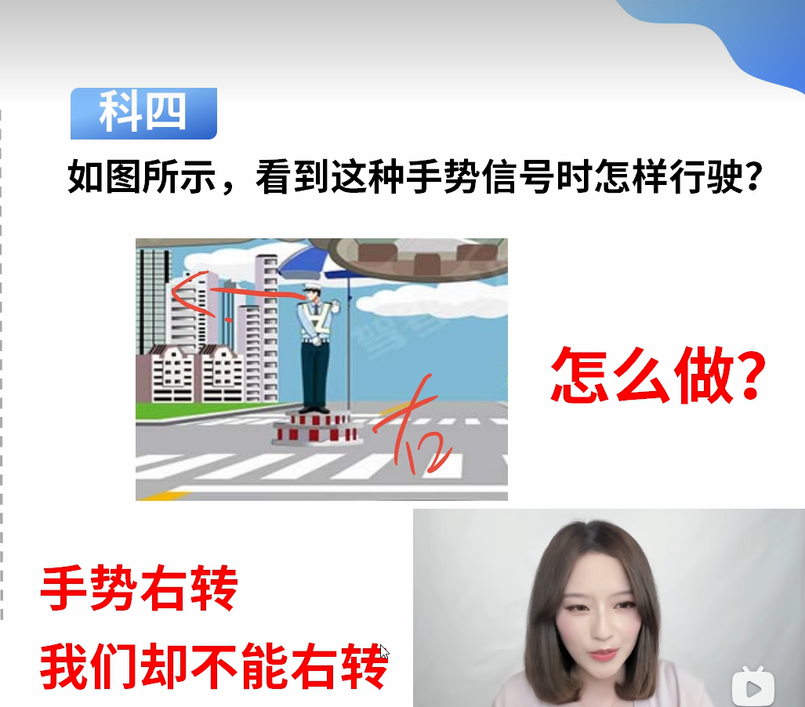
    - 交警脸不对我,掌心对我 ,那么我需要停车

  ## 交通标志
  - 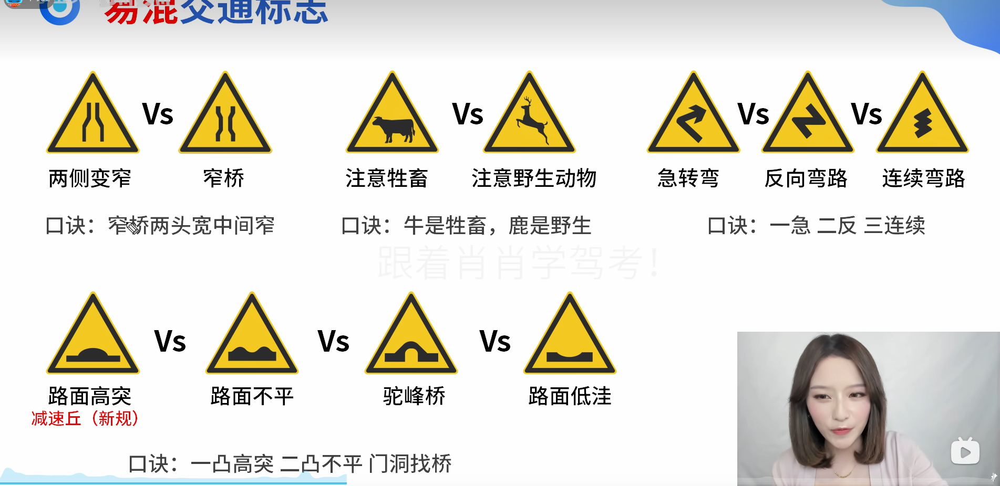
  - 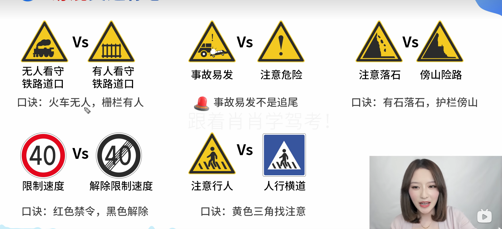
  - 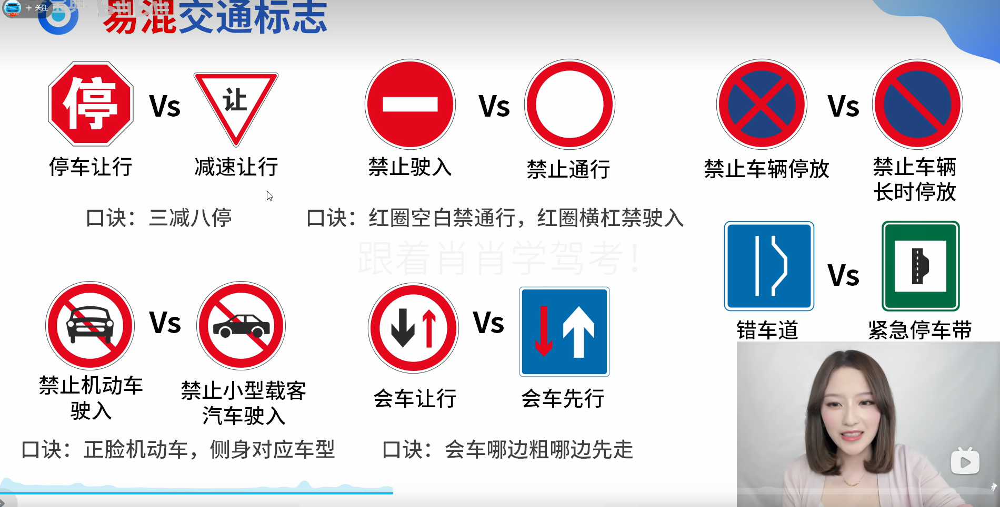
  - 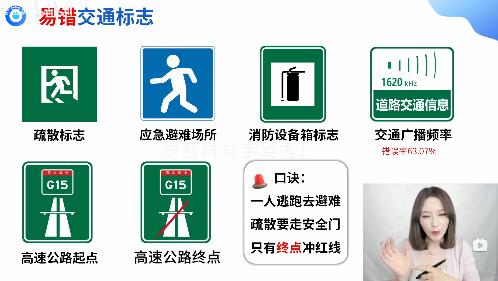
  - 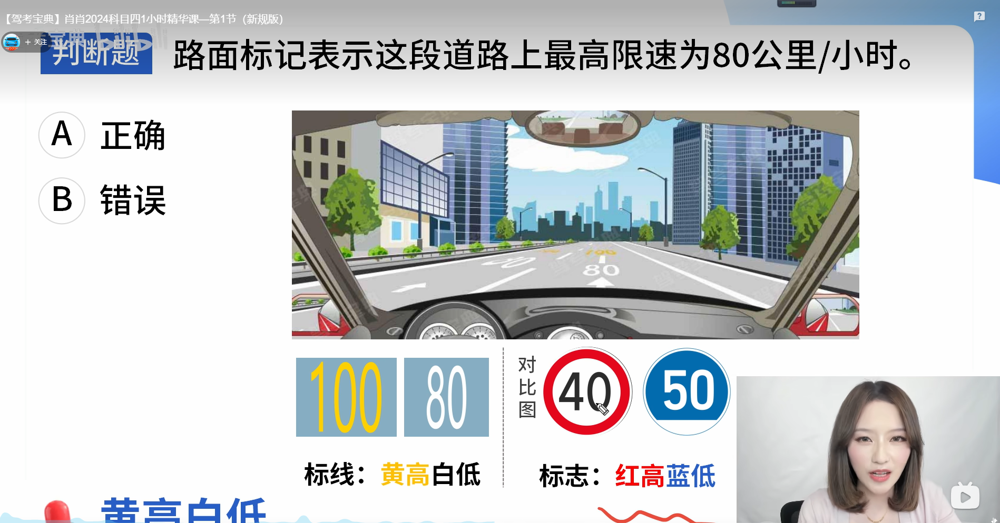 黄高白低,红高蓝低

# 安全文明驾驶
  
# 安全装置
  - 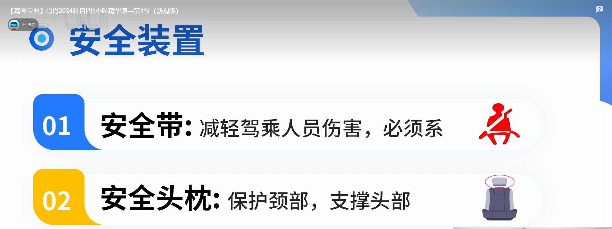
  - 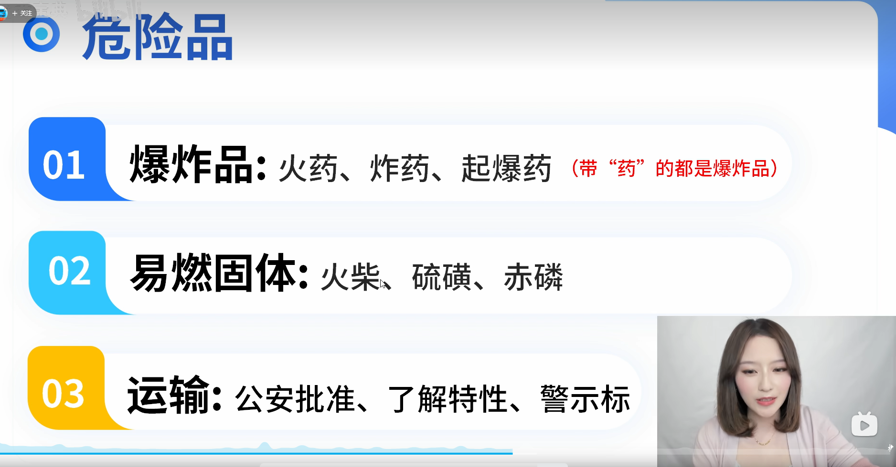 带药的都是爆炸品

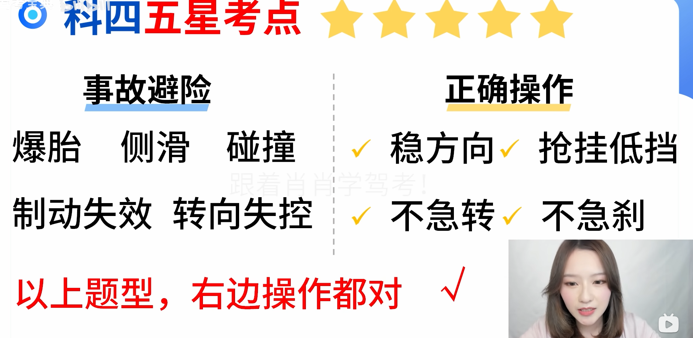